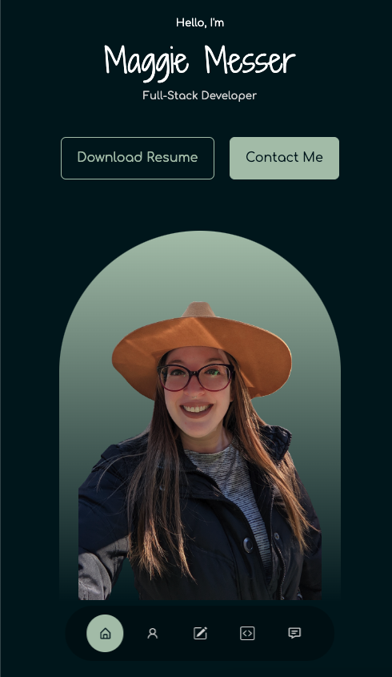

  # Maggie Messer's React Portfolio

  ## Badges
  

  ## Description
  🔮 Created a new portfolio using React with mobile-first design and attractive UX/UI to communicate skill set to potential future employers. React Icons were implemented in the navigation bar and throughout the portfolio for social medias and bullet points. EmailJS was implemented in Contact form to send messages directly through the application.  SwiperJS was implemented for testimonials section, although testimonials section is currently hidden until client reviews are received. Portfolio styled with native CSS and some Bootstrap classes.    

  

  ## 📚 Table of Contents
  * [🎢 Usage](#usage)
  * [🚧 Contribution](#contribution)
  * [🔑 License](#license)
  * [❓ Questions](#questions)
  
  ## Usage 
  🎢 Portfolio deployed on GitHub Pages. [Live Site](https://magmesser.github.io/react-portfolio/)

  ## Contribution 
  🚧 [Contributor Covenant](https://www.contributor-covenant.org/)   

  ## License
  🔑 This application is covered under the MIT license.    
      Find out more here: https://choosealicense.com/licenses/mit/  
      

  ## Questions
  ❓ Have questions? Please contact Maggie Messer at:  
  * magmesser's GitHub: https://github.com/magmesser   
  * Maggie Messer's Email: magmesser@gmail.com  
  
  ❗ Repository Link: https://github.com/magmesser/react-portfolio
